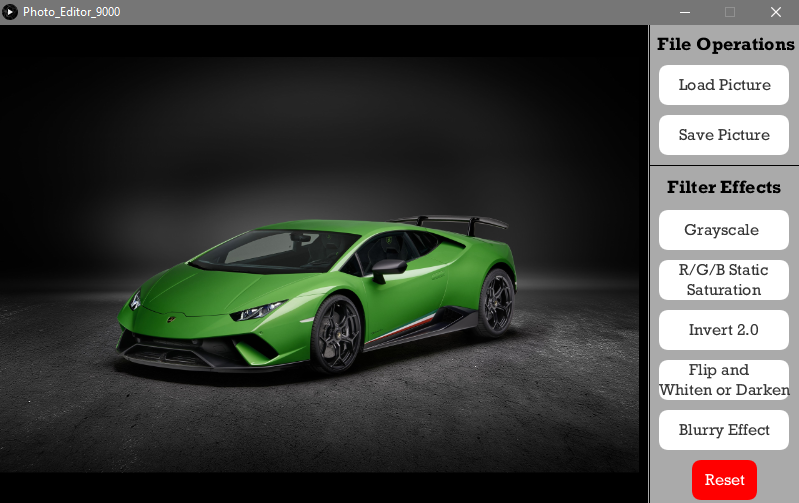
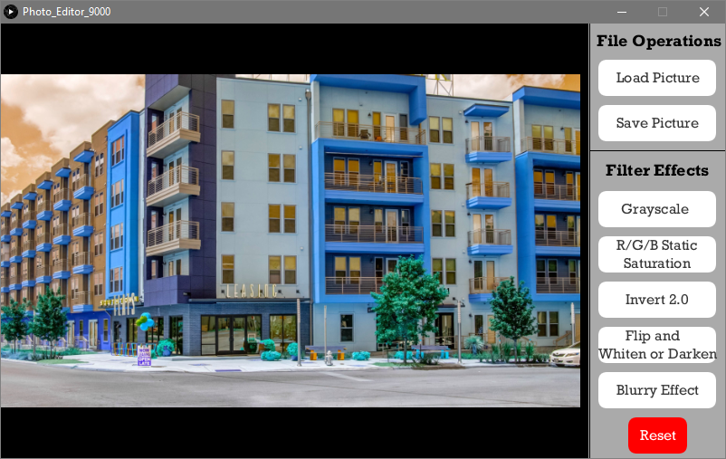

# Photo-Editor-9000
A fun digital image manipulation application!

# Instructions
- Download the necessary files for your operating system (as specified in each OS folder's README)
- Run the executable file.
- Next, load an image in by clicking the load image button located on the top right corner of the program.
- Clicking it will create a file explorer window. Find the image you wish to edit (supports all common image file types) and open it.
- The image will appear in the program.
- Next, click one of the filter buttons on the right side of the program (please refer to the filter section to see the effects and uses of the different filters).
- If you would like a more interactive experience, run the .pde file in Processing so that the console is visible. For example, in one case, text is displayed in the console if you forget to do something.
- Filters can stack on top of each other but some may override other filters (Red Saturation + Static is overridden by grey scale, but the static stays).
- To remove all filter effects, click the reset button.
-If you like the result of the filters, you can save the new image by hitting the “Save Picture” button below the “Load Picture” button.

# Filters
## Filter 2: Red/Green/Blue “Static” Saturation
If ‘r’ on the keyboard is pressed before selecting this filter, then a red saturation will be applied. The same applies for green and blue with ‘g’ and ‘b’, respectively. If no key is pressed before the filter is applied, then the filter displays a message in the console prompting the user to tap a key before activating the filter; in this case, nothing happens to the image. The program executes filter 1 by going through a loop that will repeat for each pixel in the image. Inside of that loop, the current pixel’s color is obtained. Then, the red, green, or blue value is increased by 50 depending on which keyboard button was pressed before. The filter is considered static because each time the loop is run, there is a 50% chance that the index will be increased by 2. Therefore, the image appears static after this filter is applied. The 50% possibility is determined through the random() function.

Original Image:

Green Static Saturation:

## Filter 3: Invert 2.0
In this filter, there is a 50% chance of 1 out of 2 things happening. This possibility is created by using the function random(). The first possibility is invert #1.The second possibility is invert #2. They are not supposed to represent a perfect invert, but they do give the same kind of look. The invert looks are created by running through a loop that goes through all the pixels in the image loaded. Inside the loop, each pixel’s color is obtained. Then, the red, green, and blue values are swapped to create a cool invert effect. In one of the possibilities, green goes in for the red value, blue goes in for the green value, and red goes in for the blue value. In the other filter, green goes in for the red value, red goes in for the green value, and blue stays where it is.

Original Image:

Invert Effect 1:

Invert Effect 2:

## Filter 4: Flip and Whiten or Darken
When this filter is applied, a loop runs through all the pixels in the image and stores them in a temporary array. Then, it runs through the pixels again and makes the 1st pixel the last pixel, and so on, until the image is flipped. It does this by setting pixel[index] to tempArray[img.pixels.length-1-index]. While it sets this, there is also a 50% chance that the image will be whitened. The other 50% chance is that the image will be darkened. The program does this by increasing or decreasing all RGB values by a set amount.

Original Image:

Flipped and Darkened:

Flipped and Lightened:

## Filter 5: Blurry Effect aka the Phase Shift
When this filter is applied, a leapfrog effect is made. The program does this by loading up the pixels and running through a while loop. In this loop, a pixel’s color is stored in a temporary color object. The pixel's color is then changed to the color of the pixel behind it, which is found in another temporary color object. The program keeps doing this until it has processed all the pixels. The program changes every other pixel using the modulus function. This makes every other pixel “move” to the right, causing a blurry effect.

Original Image:

With Blur Effect:

